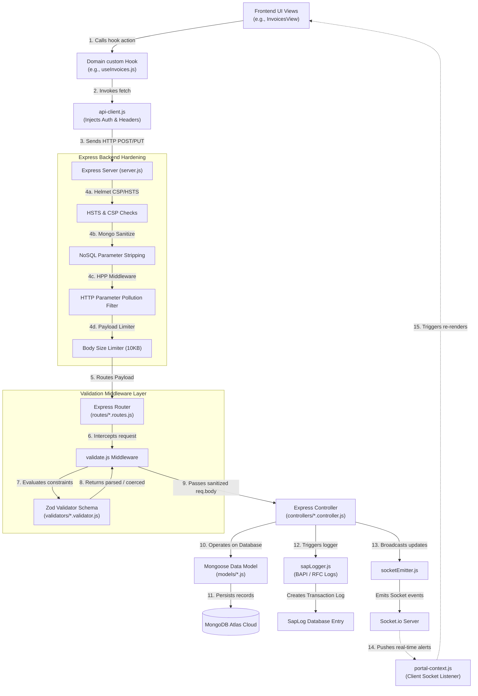

# SAP VendorConnect Portal — Request Flow & Validation Architecture

This document explains the end-to-end flow of transactional data between the frontend and backend, focusing on the security filters, Zod schemas, and parser layers implemented in Phase 5 (Days 1 & 2).

---

## 1. Architectural Architecture Diagram

Below is the request-response lifecyle tracing a client transaction (e.g. submitting an invoice, dispatching an ASN, bidding, etc.) through the system:



---

## 2. Frontend Layer (Initiating Requests)

Transactions begin on the Next.js frontend UI views, which interact with domain custom hooks:
1.  **Domain Feature Hooks**: Located in `src/features/<feature>/hooks/`, these hooks (e.g., `useInvoices.js`, `usePOs.js`, `useRFQs.js`) manage transactional components.
2.  **API Client**: Requests are channeled through [api-client.js](file:///a:/sap_vendor_portal/src/lib/api-client.js). The client handles:
    *   Injecting the default authorization headers (such as Clerk user identifiers).
    *   Structuring JSON payloads.
    *   Forwarding backend calls to the correct API base URL.

---

## 3. Backend Hardening Stack (server.js)

Upon reaching the Express backend, [server.js](file:///a:/sap_vendor_portal/backend/server.js) processes the request through several security filters:
1.  **Helmet Headers**: Checks Content Security Policy (CSP) configurations and appends HSTS rules.
2.  **Query Redefinition Workaround**: Configures a mutable `req.query` object, ensuring compatibility between Express 5 lazy getters and older sanitization libraries.
3.  **Mongo Sanitize**: Sanitizes incoming request bodies, queries, and parameters by stripping keys starting with `$` or `.` to prevent NoSQL query injection.
4.  **HPP Filter**: Sanitizes parameters to prevent HTTP Parameter Pollution attacks.
5.  **Payload Size Limiter**: Restricts JSON body payloads to a maximum of `10kb` (excluding file uploads) to prevent resource denial-of-service (DoS) attempts.

---

## 4. Route Validation Layer (Validators & validate.js)

Requests are forwarded from the routers to our custom validation middleware:
1.  **Router Registration**: Backend routes (e.g., [rfq.routes.js](file:///a:/sap_vendor_portal/backend/routes/rfq.routes.js), [vendor.routes.js](file:///a:/sap_vendor_portal/backend/routes/vendor.routes.js)) register the generic [validate.js](file:///a:/sap_vendor_portal/backend/middleware/validate.js) middleware.
2.  **Generic Zod Parser Middleware**:
    *   Calls `schema.safeParse(req.body)` using the corresponding Zod validation schema.
    *   **Success**: Coerces field types (e.g., turning string numbers or dates into proper Javascript entities), filters out unrecognized/malicious parameters, assigns the sanitized output back to `req.body`, and delegates execution to the controller via `next()`.
    *   **Failure**: Aggregates all Zod error issues into a key-value mapping (`{ "field.path": "error message" }`) and returns a `400 Bad Request` structure.

```javascript
// backend/middleware/validate.js
const validate = (schema) => (req, res, next) => {
  const result = schema.safeParse(req.body);
  if (!result.success) {
    const errors = result.error.issues.reduce((acc, e) => {
      acc[e.path.join('.')] = e.message;
      return acc;
    }, {});
    return res.status(400).json({ success: false, errors });
  }
  req.body = result.data;
  next();
};
```

---

## 5. Active Zod Validators

All schemas are placed under `backend/validators/` and specify constraints for each API route:
*   [vendor.validator.js](file:///a:/sap_vendor_portal/backend/validators/vendor.validator.js): Contains `profileCreateSchema` and `profileUpdateSchema`. Supports both flat forms and nested address/bank details layouts to maintain backward compatibility.
*   [rfq.validator.js](file:///a:/sap_vendor_portal/backend/validators/rfq.validator.js): Inspects target prices, currency, dates, and bid parameters (such as `unitPrices` records and lead time integers).
*   [invoice.validator.js](file:///a:/sap_vendor_portal/backend/validators/invoice.validator.js): Implements quantity, price, and matching rules to check invoice items before Migo validation.
*   [asn.validator.js](file:///a:/sap_vendor_portal/backend/validators/asn.validator.js): Checks shipping documents, estimated delivery times, and line dispatch quantities.
*   [chat.validator.js](file:///a:/sap_vendor_portal/backend/validators/chat.validator.js): Restricts text messages to a maximum of 1000 characters.
