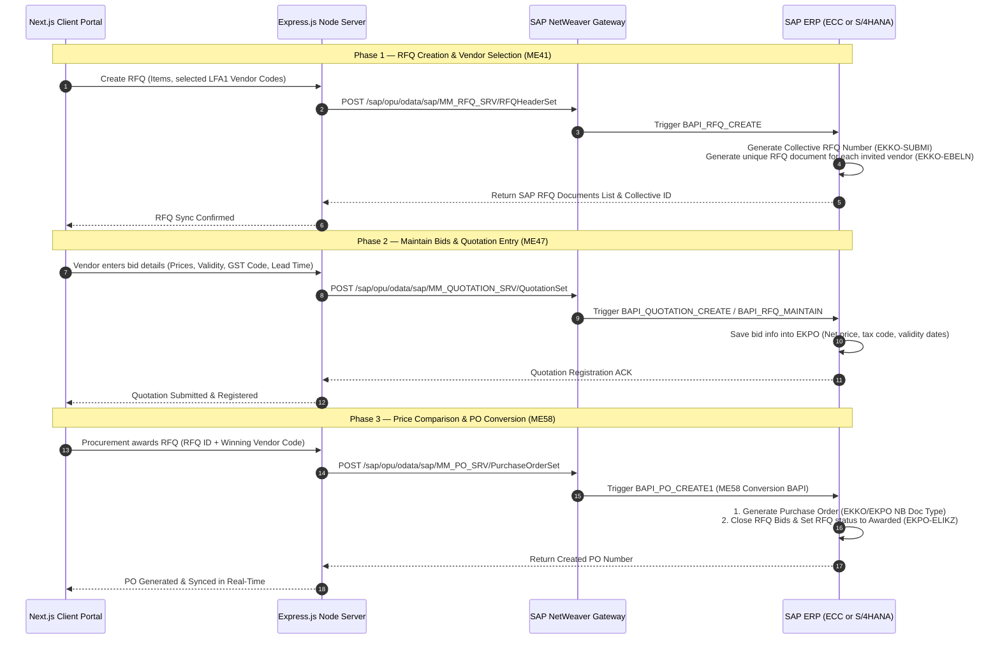
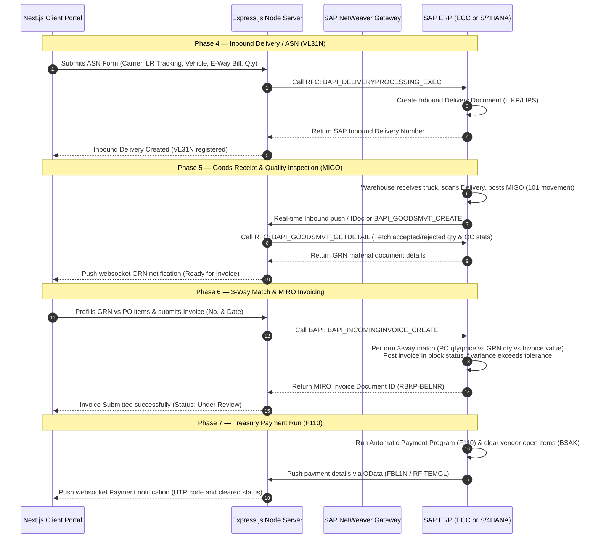

# SAP Communication Architecture — End-to-End Enterprise Integration Specifications
> **Classification**: Technical Specifications & Architecture Design · **Modules**: MM (Materials Management), FI (Financial Accounting), AP (Accounts Payable)

This document details the target integration architecture, interface maps, and data flow pipelines for connecting the VendorConnect Portal with a production SAP ERP (ECC or S/4HANA) system for all key transactional touchpoints.

---

## 1. Integration Technology & Protocols

To transition from the simulated MongoDB/Express backend to an official SAP instance, we leverage three primary enterprise integration pathways:

### Option A: SAP NetWeaver Gateway (OData Services) — *Recommended for S/4HANA*
* **Architecture**: RESTful OData V2/V4 services exposed via SAP NetWeaver Gateway (Transaction `/IWFND/GW_CLIENT`).
* **Protocol**: HTTP/JSON.
* **Usage**: Used for PO Sync (`/API_PURCHASEORDER_PROCESS_SRV`) and Payment Status Sync (`FBL1N` OData extract).
* **Pros**: Direct integration with Next.js/React frameworks; standardized JSON payloads; robust CRUD actions; support for SAP standard annotations.

### Option B: SAP Integration Suite / SAP CPI (Cloud Platform Integration)
* **Architecture**: Middleware translation layer. The Node.js server posts REST JSON payloads to SAP CPI, which transforms them into SOAP XML or standard IDoc formats to trigger downstream SAP BAPIs.
* **Protocol**: HTTPS / SOAP / AS2.
* **Usage**: Ideal for asynchronous processes like Invoice Posting (`BAPI_INCOMINGINVOICE_CREATE`) and Inbound Delivery (`BAPI_DELIVERYPROCESSING_EXEC`).
* **Pros**: Decouples client portal from core ERP; handles queue retries, payload mapping, and audit logging out-of-the-box.

### Option C: Direct RFC Connection via Node-RFC
* **Architecture**: Uses the SAP NW RFC SDK node bindings (`node-rfc`) to initiate Remote Function Calls (RFC/BAPIs) directly on the SAP application server.
* **Protocol**: SAP RFC Protocol.
* **Usage**: Real-time synchronous checks like GRN Sync (`BAPI_GOODSMVT_GETDETAIL`).
* **Pros**: Extremely low latency; handles standard SAP transaction controls (Commit/Rollback).

---

## 2. Comprehensive SAP Integration Touchpoints Map

The following matrix represents the end-to-end integration map implemented in the VendorConnect Portal:

| Business Process | SAP Transaction Code | Integration Service / BAPI Name | Interface Type | Triggering Event |
| :--- | :--- | :--- | :--- | :--- |
| **Vendor Onboarding** | `XK01` / `XK02` | `BAPI_VENDOR_CREATE` / `BAPI_VENDOR_CHANGE` | RFC / BAPI | On vendor registration approval |
| **Purchase Order Sync** | `ME21N` / `ME22N` | `/API_PURCHASEORDER_PROCESS_SRV` | OData v2 | Real-time push from ERP |
| **Inbound Delivery** | `VL31N` | `BAPI_DELIVERYPROCESSING_EXEC` | RFC / BAPI | On ASN dispatch submission |
| **Goods Receipt Note** | `MIGO` (101) | `BAPI_GOODSMVT_CREATE` | RFC / BAPI | On warehouse posting |
| **GRN Detail Sync** | `MIGO` | `BAPI_GOODSMVT_GETDETAIL` | RFC / BAPI | On MIGO material document creation |
| **Invoice Posting** | `MIRO` | `BAPI_INCOMINGINVOICE_CREATE` | REST / RFC | On portal 3-way match & submit |
| **Payment Sync** | `F110` / `FBL1N` | `FBL1N - RFITEMGL` | OData / BW | Nightly batch + real-time status pull |

---

## 3. End-to-End Operational Data Flows

### A. Procurement & Vendor Bidding Flow (RFQ to PO)

### B. Shipping, Receiving, & Financial Settlements Flow (ASN to Payment)

---

## 4. SAP Table & Schema Mapping Reference

The following table provides the mapping details between the Node.js database cache schemas and the underlying SAP ERP database tables:

### A. Vendor Master Data Mapping (`LFA1` / `LFB1` / `LFM1`)
| Portal Field (JSON/Mongoose) | SAP Table | SAP Field Name | SAP Data Type / Description |
| :--- | :--- | :--- | :--- |
| `profile.sapVendorCode` | `LFA1` | `LIFNR` | `CHAR (10)` — Account Number of Vendor / Supplier |
| `profile.companyName` | `LFA1` | `NAME1` | `CHAR (35)` — Name 1 of Vendor |
| `profile.gstin` | `DFKKBPTAXNUM` | `TAXNUM` | `CHAR (20)` — Tax Number (GSTIN in India) |
| `profile.pan` | `LFA1` | `J_1IPANNO` | `CHAR (10)` — Permanent Account Number (PAN in India) |
| `profile.msmeNumber` | `LFA1` | `MSME_NO` | `CHAR (20)` — Custom Field for MSME Registration Number |
| `profile.bankName` | `BNKA` | `BANKA` | `CHAR (60)` — Name of Bank |
| `profile.accountNumber` | `LFBK` | `BANKN` | `CHAR (18)` — Bank Account Number |
| `profile.ifscCode` | `BNKA` | `BRNCH` | `CHAR (11)` — Bank Branch (IFSC Code in India) |

### B. Purchase Order & Item Mapping (`EKKO` / `EKPO`)
| Portal Field (JSON/Mongoose) | SAP Table | SAP Field Name | SAP Data Type / Description |
| :--- | :--- | :--- | :--- |
| `po.id` | `EKKO` | `EBELN` | `CHAR (10)` — Purchasing Document Number |
| `po.companyCode` | `EKKO` | `BUKRS` | `CHAR (4)` — Company Code |
| `po.createdDate` | `EKKO` | `AEDAT` | `DATS (8)` — Date on which record was created |
| `po.status` | `EKKO` | `PROC_STATUS` | `CHAR (2)` — Purchasing Document Status |
| `po.items.line` | `EKPO` | `EBELP` | `NUMC (5)` — Item Number of Purchasing Document |
| `po.items.materialCode` | `EKPO` | `MATNR` | `CHAR (40)` — Material Number |
| `po.items.description` | `EKPO` | `TXZ01` | `CHAR (40)` — Short Text |
| `po.items.quantity` | `EKPO` | `MENGE` | `QUAN (13,3)` — Order Quantity |
| `po.items.uom` | `EKPO` | `MEINS` | `UNIT (3)` — Purchase Unit of Measure |
| `po.items.unitPrice` | `EKPO` | `NETPR` | `CURR (11,2)` — Net Price in Document Currency |
| `po.items.taxCode` | `EKPO` | `MWSKZ` | `CHAR (2)` — Tax on Sales/Purchases Code (e.g. G1) |

### C. Inbound Delivery / ASN Mapping (`LIKP` / `LIPS`)
| Portal Field (JSON/Mongoose) | SAP Table | SAP Field Name | SAP Data Type / Description |
| :--- | :--- | :--- | :--- |
| `asn.sapInboundDelivery` | `LIKP` | `VBELN` | `CHAR (10)` — Inbound Delivery Document Number |
| `asn.shipDate` | `LIKP` | `WADAT` | `DATS (8)` — Actual Goods Issue / Shipping Date |
| `asn.estimatedDeliveryDate`| `LIKP` | `LFDAT` | `DATS (8)` — Delivery Date (Expected) |
| `asn.carrierName` | `LIKP` | `TDLNR` | `CHAR (10)` — Number of Forwarding Agent |
| `asn.trackingNumber` | `LIKP` | `LIFEX` | `CHAR (35)` — External Identification of Delivery Note |
| `asn.vehicleNumber` | `LIKP` | `TRAID` | `CHAR (20)` — Means of Transport ID |
| `asn.ewayBillNo` | `LIKP` | `EWAY_NO` | `CHAR (12)` — Custom Field for GST E-Way Bill Number |
| `asn.items.line` | `LIPS` | `POSNR` | `NUMC (6)` — Item Number of Inbound Delivery |
| `asn.items.shippedQuantity` | `LIPS` | `LFIMG` | `QUAN (13,3)` — Actual Quantity Delivered |

### D. Goods Receipt Document Mapping (`MKPF` / `MSEG`)
| Portal Field (JSON/Mongoose) | SAP Table | SAP Field Name | SAP Data Type / Description |
| :--- | :--- | :--- | :--- |
| `grn.sapMigoDoc` | `MKPF` | `MBLNR` | `CHAR (10)` — Number of Material Document |
| `grn.postingDate` | `MKPF` | `BUDAT` | `DATS (8)` — Posting Date in the Document |
| `grn.receivedBy` | `MKPF` | `USNAM` | `CHAR (12)` — User Name |
| `grn.items.line` | `MSEG` | `ZEILE` | `NUMC (4)` — Item in Material Document |
| `grn.items.acceptedQuantity`| `MSEG` | `ERFMG` | `QUAN (13,3)` — Quantity in Unit of Entry (Accepted) |
| `grn.items.rejectedQuantity`| `MSEG` | `REJ_QTY` | `QUAN (13,3)` — Custom Field for QC Rejected Quantity |
| `grn.items.materialCode` | `MSEG` | `MATNR` | `CHAR (40)` — Material Number |
| `grn.items.movementType` | `MSEG` | `BWART` | `CHAR (3)` — Movement Type (e.g. 101) |

### E. Vendor Invoice & Clearing Mapping (`RBKP` / `RSEG` / `BSAK`)
| Portal Field (JSON/Mongoose) | SAP Table | SAP Field Name | SAP Data Type / Description |
| :--- | :--- | :--- | :--- |
| `invoice.sapMiroDoc` | `RBKP` | `BELNR` | `CHAR (10)` — Number of Invoice Document (MIRO) |
| `invoice.invoiceNumber` | `RBKP` | `XBLNR` | `CHAR (16)` — Reference Document Number |
| `invoice.invoiceDate` | `RBKP` | `BLDAT` | `DATS (8)` — Document Date in Document |
| `invoice.status` | `RBKP` | `RBSTAT` | `CHAR (1)` — Invoice Document Status (e.g. Blocked / Posted) |
| `invoice.totalAmount` | `RBKP` | `RMGWR` | `CURR (13,2)` — Gross Invoice Amount in Document Currency |
| `payment.sapPaymentDoc` | `BSAK` | `BELNR` | `CHAR (10)` — Accounting Document Number (Clearing Doc) |
| `payment.utrCode` | `BSAK` | `KIDNO` | `CHAR (30)` — Payment Reference (UTR Reference for bank transfer) |
| `payment.paymentDate` | `BSAK` | `AUGDT` | `DATS (8)` — Clearing Date |
| `payment.netAmount` | `BSAK` | `WRBTR` | `CURR (13,2)` — Amount in Document Currency (Paid) |
| `payment.tdsDeducted` | `WITH_ITEM` | `WT_QSSHH` | `CURR (13,2)` — Withholding Tax Amount (TDS) |
