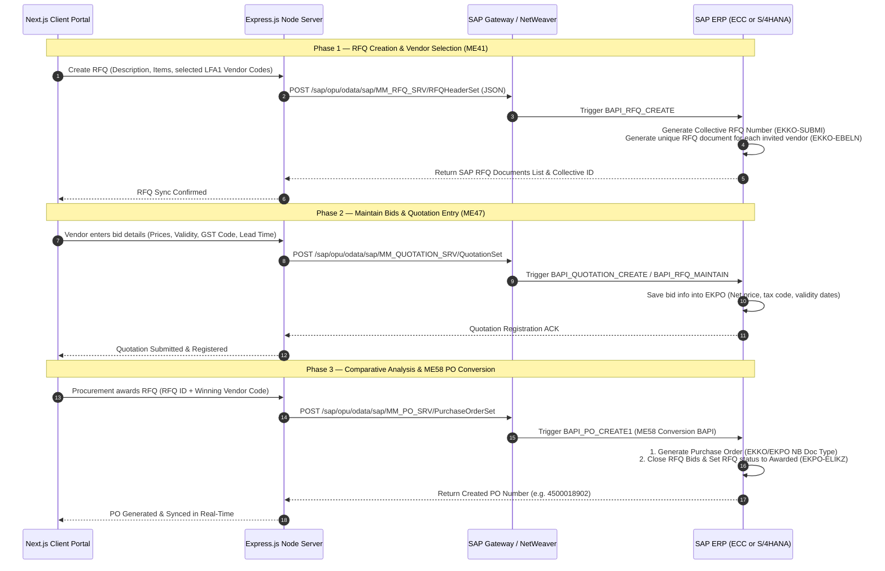

# SAP Communication Architecture — RFQ & Vendor Bidding Integration
> **Classification**: Technical Specifications & Architecture Design · **Module**: MM (Materials Management)

This document details the target integration architecture, interface maps, and data flow pipelines for connecting the VendorConnect Portal with a production SAP ERP (ECC or S/4HANA) system for RFQ and Vendor bidding transactions.

---

## 1. Integration Technology & Protocols

To transition from the simulated MongoDB/Express backend to an official SAP instance, we can choose from three primary enterprise integration pathways:

### Option A: SAP NetWeaver Gateway (OData Services) — *Recommended for S/4HANA*
* **Architecture**: RESTful OData V2/V4 services exposed via SAP NetWeaver Gateway (Transaction `/IWFND/GW_CLIENT`).
* **Protocol**: HTTP/JSON.
* **Pros**: Direct integration with Next.js/React frameworks; standardized JSON payloads; robust CRUD actions; support for SAP standard annotations.

### Option B: SAP Integration Suite / SAP CPI (Cloud Platform Integration)
* **Architecture**: Middleware translation layer. The Node.js server posts REST JSON payloads to SAP CPI, which transforms them into SOAP XML or standard IDoc formats to trigger downstream SAP BAPIs.
* **Protocol**: HTTPS / SOAP / AS2.
* **Pros**: Decouples client portal from core ERP; handles queue retries, payload mapping, and audit logging out-of-the-box.

### Option C: Direct RFC Connection via Node-RFC
* **Architecture**: Uses the SAP NW RFC SDK node bindings (`node-rfc`) to initiate Remote Function Calls (RFC/BAPIs) directly on the SAP application server.
* **Protocol**: SAP RFC Protocol.
* **Pros**: Extremely low latency; handles standard SAP transaction controls (Commit/Rollback).

---

## 2. End-to-End RFQ & Quotation Data Flow

Below is the execution pipeline for creating RFQs, inviting vendors, maintaining quotations (bidding), and converting winning bids to Purchase Orders:

---

## 3. SAP Transaction & BAPI Specification

### A. RFQ Creation (ME41)
* **BAPI Name**: `BAPI_RFQ_CREATE` (or Custom RFC wrapper `Z_BAPI_RFQ_CREATE_MULTI`)
* **Transaction Reference**: `ME41`
* **Operational Logic**: 
  * The Node server sends a single POST request containing multiple invited vendor codes.
  * In SAP, a separate Purchasing Document (`EBELN`) of type `AN` (RFQ) is created for each invited vendor.
  * All generated RFQ documents are grouped under a single Collective Number (`SUBMI` field in table `EKKO`). This Collective Number is passed back to the database as the reference ID.

### B. Quotation Maintenance & Pricing (ME47)
* **BAPI Name**: `BAPI_QUOTATION_CREATE` (or `BAPI_RFQ_MAINTAIN`)
* **Transaction Reference**: `ME47`
* **Operational Logic**: 
  * When a vendor submits a bid, they submit it against their specific RFQ Document Number.
  * The BAPI updates the corresponding SAP RFQ document. The pricing data is written directly to the quotation items table (`EKPO-NETPR`), and the tax rate is mapped to the corresponding SAP Tax Code (`EKPO-MWSKZ`).

### C. Price Comparison & Comparative Analysis (ME48)
* **API Route**: `GET /sap/opu/odata/sap/MM_RFQ_SRV/RFQHeaderSet?$filter=CollectiveNumber eq 'SUBMI_VALUE'&$expand=RFQItems,RFQQuotations`
* **Transaction Reference**: `ME49`
* **Operational Logic**:
  * Instead of calculating evaluations locally using mock parameters, Node queries SAP using the Collective Number.
  * SAP returns all matched RFQs along with their quotation prices. Node applies the weighted grading schema to display comparative matrix grids in the Fiori frontend.

### D. RFQ-to-PO Conversion (ME58)
* **BAPI Name**: `BAPI_PO_CREATE1`
* **Transaction Reference**: `ME58` / `ME21N`
* **Operational Logic**:
  * Upon awarding, the Node server invokes the Purchase Order creation BAPI, passing the reference RFQ Document ID and selected item line numbers.
  * SAP creates a standard Purchase Order (`Doc Type: NB`) and copies the quotation prices, shipping terms, and vendor reference fields. 
  * SAP flags the selected RFQ item line as completed (`EKPO-ELIKZ` set to true) so it cannot be double-awarded.

---

## 4. SAP Table & Schema Mapping Reference

The following table provides the mapping details between the Node.js MongoDB cache schema and the underlying SAP ERP database tables:

| Portal field (JSON/Mongoose) | SAP Table | SAP Field Name | SAP Data Type / Description |
| :--- | :--- | :--- | :--- |
| `rfq.id` | `EKKO` | `EBELN` | `CHAR (10)` — Purchasing Document Number |
| `rfq.rfqType` | `EKKO` | `BSART` | `CHAR (4)` — RFQ Document Type (AN) |
| `rfq.collectiveNo` | `EKKO` | `SUBMI` | `CHAR (10)` — Collective Number |
| `rfq.createdDate` | `EKKO` | `AEDAT` | `DATS (8)` — Date on which record was created |
| `rfq.items.line` | `EKPO` | `EBELP` | `NUMC (5)` — Item Number of Purchasing Document |
| `rfq.items.materialCode` | `EKPO` | `MATNR` | `CHAR (18/40)` — Material Number |
| `rfq.items.quantity` | `EKPO` | `MENGE` | `QUAN (13,3)` — Order Quantity |
| `rfq.items.uom` | `EKPO` | `MEINS` | `UNIT (3)` — Purchase Unit of Measure |
| `rfq.items.targetPrice` | `EKPO` | `TBTWR` | `CURR (11,2)` — Target Value in Document Currency |
| `rfq.bids.unitPrices` | `EKPO` | `NETPR` | `CURR (11,2)` — Net Price in Document Currency |
| `rfq.bids.taxCode` | `EKPO` | `MWSKZ` | `CHAR (2)` — Tax on Sales/Purchases Code (e.g. G1) |
| `rfq.invitedVendors.id` | `LFA1` | `LIFNR` | `CHAR (10)` — Account Number of Vendor / Supplier |
| `rfq.awardedVendorId` | `EKKO` | `LIFNR` | `CHAR (10)` — Winning Vendor Account Code |
| `rfq.convertedPoId` | `EKKO` | `KONNR` | `CHAR (10)` — Reference PO Document ID |
