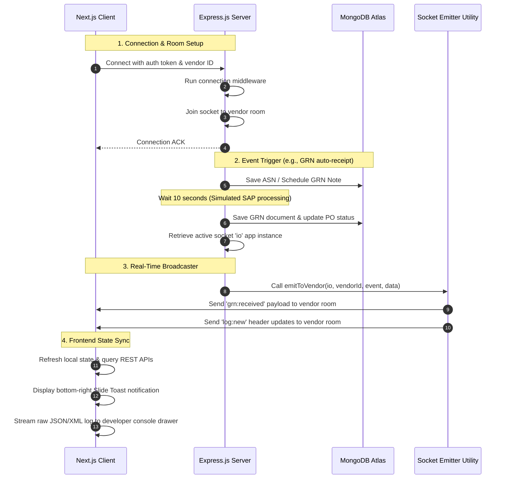
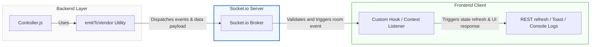

# Socket.io Real-Time Event Architecture

This document details the real-time event pipeline implemented in the SAP VendorConnect Portal. The architecture ensures instant notification delivery, database synchronization, and developer log tracing without manual browser page polling.

---

## 1. Overview & Data Flow

The real-time engine coordinates state updates between the simulated SAP ERP backend, the Express server, and the Next.js client.



---

## 1.1 Simplified Operational Pipeline (Visual Flow)

Your conceptual model of the Socket.io architecture maps directly to the active codebase. Below is the visual representation of this simplified flow:



---

## 2. System Component Roles

### 🔌 Socket Connection & Lifecycle — [backend/server.js](file:///a:/sap_vendor_portal/backend/server.js)
The server bootstraps HTTP and Socket.io, configuring a CORS policy mapping to the Next.js frontend port.
* **Handshake Authentication**: Evaluates socket connection parameters. In pre-auth development mode, it uses fallback parameters (`x-vendor-id` or local auth structures) to resolve the `socket.clerkUserId` descriptor.
* **Room Multi-Tenancy**: Isolates socket connections by putting them into specific rooms based on their vendor ID. This ensures that vendor `A` never receives logs or transaction sheets destined for vendor `B`.

### 📣 Broadcast Engine — [backend/utils/socketEmitter.js](file:///a:/sap_vendor_portal/backend/utils/socketEmitter.js)
Decouples backend business operations from Socket.io library logic. It specifies the event name registry and manages the room-targeted distribution of payloads:
* `emitToVendor(io, clerkUserId, event, data)`: Routes the event packet directly to the specific vendor's socket room.
* `emitToProcurement(io, event, data)`: Routes internal buyer and procurement messages to the `'procurement'` staff room.

### 🏢 Client Gateway — [src/lib/socket.js](file:///a:/sap_vendor_portal/src/lib/socket.js)
Maintains a single-socket instance on the frontend. It manages socket creation using WebSockets transport rules, sets reconnect attempts to `5` before throwing connection errors, and cleans up event listeners on user sign-out.

### 🔄 React Shell Coordination Context — [src/lib/portal-context.js](file:///a:/sap_vendor_portal/src/lib/portal-context.js)
Acts as the central receiver on the client. Once the user session initializes, it configures listeners to automatically sync state and trigger UI feedback:
* **State Refreshing**: Directs sub-hooks (e.g., `poHook`, `paymentHook`) to fetch fresh data from REST endpoints when new transactions are received.
* **Toast Dispatching**: Triggers bottom-right sliding notifications.
* **SAP Log Feeds**: Captures transactional details and updates the developer panel drawer immediately.

---

## 3. Real-Time Event Pipeline Specification

| Event Name | Origin (Backend Source) | Payload Details | Client Action & State Resolution |
| :--- | :--- | :--- | :--- |
| **`po:new`** | [po.controller.js](file:///a:/sap_vendor_portal/backend/controllers/po.controller.js#L155) | Full simulated PO object | Refreshes PO dashboard; prints SAP OData Log (`ZPD_PO_SRV/PurchaseOrderSet`); triggers info toast. |
| **`grn:received`** | [po.controller.js](file:///a:/sap_vendor_portal/backend/controllers/po.controller.js#L319) | Full GRN receipt data | Refreshes GRNs, POs, and ASNs; prints SAP Inbound IDoc Log (`MBGMCR03_GRN_IDoc`); triggers success toast. |
| **`payment:cleared`** | [invoice.controller.js](file:///a:/sap_vendor_portal/backend/controllers/invoice.controller.js#L241) | Payment reference, TDS details, gross/net totals | Refreshes Invoices and Payments; prints SAP Inbound payment IDoc Log (`PAYEXT_F110_PAYMENT`); triggers success toast. |
| **`chat:message`** | [chat.controller.js](file:///a:/sap_vendor_portal/backend/controllers/chat.controller.js#L52) | Active Message entity | Updates active chat panel array; triggers panel autoscroll; handles 2s buyer auto-replies. |
| **`log:new`** | Various Controllers | Event headers (`type`, `name`, `payload`) | Streams outbound/inbound SAP RFC transaction payloads to the developer drawer console. |

---

## 4. Key Code Implementations

### Socket Server Handshake & Room Assignment
```javascript
// From backend/server.js
io.use((socket, next) => {
  const token = socket.handshake.auth.token;
  const fallbackVendorId = socket.handshake.auth.vendorId || socket.handshake.headers['x-vendor-id'] || 'mock_vendor_id';
  
  socket.clerkUserId = fallbackVendorId;
  next();
});

io.on('connection', (socket) => {
  if (socket.clerkUserId) {
    socket.join(socket.clerkUserId); // Isolates real-time feeds to this vendor
  }
});
```

### Dispatching Simulators (Express.js Controller example)
```javascript
// From backend/controllers/po.controller.js
const io = req.app.get('io');
const { EVENTS, emitToVendor } = require('../utils/socketEmitter');

// Sends Goods Receipt confirmation to client room
emitToVendor(io, latestAsn.vendorId, EVENTS.GRN_RECEIVED, grn);

// Triggers developer console log feed update
emitToVendor(io, latestAsn.vendorId, EVENTS.LOG_NEW, { 
  type: 'IDoc', 
  name: 'MBGMCR03_GRN_IDoc' 
});
```

### Client Subscriptions (React 19 Context hook)
```javascript
// From src/lib/portal-context.js
useEffect(() => {
  const clerkId = profileHook.profile?.clerkId || 'mock_vendor_id';
  const socket = initSocket(null, clerkId);

  socket.on('grn:received', (grn) => {
    poHook.refreshGRNs();
    poHook.refreshPOs();
    poHook.refreshASNs();
    addToast('success', `Goods Receipt Note (GRN) received for PO: ${grn.poId}. Stores accepted your goods.`);
    shell.addSapLog('IDoc', 'MBGMCR03_GRN_IDoc', 'INBOUND', grn, 'SUCCESS');
  });

  return () => {
    closeSocket(); // Clean up connection on profile log-out
  };
}, [profileHook.profile?.clerkId]);
```
