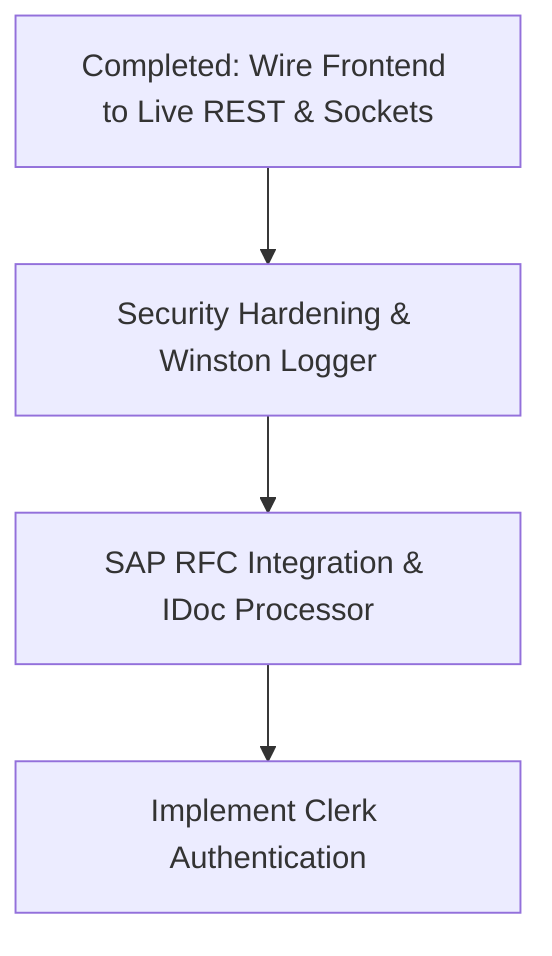

# VendorConnect Portal — Project Status & Working State
> **Classification**: Internal Project Status · **Last Updated**: June 2026

This document provides a comprehensive summary of all progress completed, current architectural state, and immediate action items to move the platform from design to production.

---

## 1. Project Overview & Architecture
**VendorConnect Portal** is a full-stack digital supply chain dashboard that bridges external suppliers and an internal enterprise SAP ERP system. 

The application utilizes a decoupled, modern architecture:
- **Frontend**: Next.js 16 (React 19) styled with premium, harmonized HSL color palettes and micro-animations, structured in a domain-driven feature pattern.
- **Backend**: Express.js server connected to a persistent MongoDB Atlas cloud database.
- **SAP Integration**: Simulated BAPI, RFC, OData, and IDoc console logger capturing real-time P2P payload logs.

---

## 2. Completed Milestones

### 🏗️ Backend Foundation & Persistence Layer
1. **Database Schema Realignment**:
   - Created all core Mongoose schemas under `backend/models/`: [Vendor.js](file:///a:/sap_vendor_portal/backend/models/Vendor.js), [RFQ.js](file:///a:/sap_vendor_portal/backend/models/RFQ.js), [PurchaseOrder.js](file:///a:/sap_vendor_portal/backend/models/PurchaseOrder.js), [ASN.js](file:///a:/sap_vendor_portal/backend/models/ASN.js), [GRN.js](file:///a:/sap_vendor_portal/backend/models/GRN.js), [Invoice.js](file:///a:/sap_vendor_portal/backend/models/Invoice.js), [Payment.js](file:///a:/sap_vendor_portal/backend/models/Payment.js), and [SapLog.js](file:///a:/sap_vendor_portal/backend/models/SapLog.js).
   - Standardized status enums and flattened schemas (such as bank details, address fields, and attachments) to match frontend wizard states.
2. **Controller & Router Scaffolding**:
   - Implemented [vendor.controller.js](file:///a:/sap_vendor_portal/backend/controllers/vendor.controller.js) with parser helpers (`mapIncomingBody`, `formatVendorResponse`) for legacy script compatibility and backwards-compatible nested models.
   - Built onboarding, profile registration, and vendor master sync APIs.
3. **E2E Backend Verification**:
   - Validated the entire supplier lifecycle (from draft creation through pending review and auto-approval sync with simulated SAP IDs) via `node backend/test_endpoints.js`.

### ⚡ Frontend Enterprise-Grade Transition (Refactor)
1. **Elimination of Legacy Monolith**:
   - Removed the single global context model (`store-context.js`) and monolithic store definition (`store.js`).
2. **Domain-Driven Feature Scaffolding**:
   - Grouped views, custom React hooks, and REST services into feature modules inside `src/features/`:
     - `profile/` (Onboarding & Registration)
     - `rfq/` (Quotations & Bidding)
     - `purchase-order/` (PO management, ASN submission, GRN tracking)
     - `billing/` (MIRO invoice processing)
     - `payments/` (TDS tracking & clearance status)
     - `dashboard/` (Chat, analytics, scorecards, and performance metrics)
3. **Unified API Client & Shell Context**:
   - Created `api-client.js` for default authorization headers and network requests.
   - Implemented `shell-context.js` (`ShellProvider`) to control navigation layout states and capture incoming SAP payload logs inside the developer console.
4. **Successful Production Build**:
   - ✅ Compiled Next.js using `npm run build` with zero errors, verifying absolute path integrity and correct import configurations.

---

## 3. Current System State

- **Active Services**: Next.js client (running on Port `3000`/`3001` or Next.js dev server) and Express backend (Port `5000`) are fully running with real-time bidirectional Socket.io channels and database persistence.
- **Full Backend Integration**: All frontend feature hooks (`usePOs`, `usePayments`, `useInvoices`, `useRFQs`, `useProfile`) and context (`portal-context.js`) are wired to call backend REST endpoints via `api-client.js`. Client-side local storage fallback structures and mock timeouts have been completely removed.
- **Real-Time Synchronization**: Handled via Socket.io events (`po:new`, `grn:received`, `payment:cleared`, `chat:message`, `log:new`) which stream live transactional updates and developer console logs directly to the client session.
- **RFQ & Bid comparative evaluation**: Fully integrated. Quotations maintain SAP info records in MongoDB, and the `Evaluate & Award (ME48)` comparative matrix calculates weighted scores and triggers PO creation dynamically.
- **Rate-Limiter Optimization**: Configured `apiLimiter` to run only in production, preventing requests from being rate-limited in local development.

---

## 4. Immediate Next Steps

### 📅 Action Plan

1. **Step 1: Completed: REST and Socket.io Integration**
   - Wired all custom hooks under `src/features/` and `portal-context.js` to real backend controllers.
   - Synchronized ASN submissions, GRN auto-receipt updates, and invoice clearance events via live Socket.io channels.
   - Cleaned up RFQ Monitor, Submit Quotation, and Evaluate & Award tabs to load all DB-managed RFQ records.

2. **Step 2: Security Hardening (Week 5)**
   - Implement Zod schema request validation in backend routes.
   - Configure Helmet headers, MongoDB injection sanitizers, and Winston logger daily-rotation.

3. **Step 3: SAP RFC Integration (Week 6)**
   - Build translation models for BAPI parameters and integrate OData / IDoc processors.

4. **Step 4: Connect Clerk Authentication (Week 7)**
   - Wrap Next.js pages in `<ClerkProvider>` and implement route rules.
   - Secure the Express server API endpoints and Socket connection rooms via `@clerk/express` middleware.
