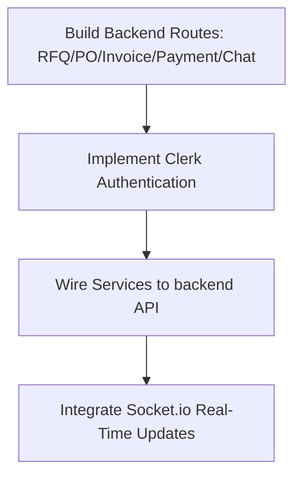

# VendorConnect Portal — Project Status & Working State
> **Classification**: Internal Project Status · **Last Updated**: June 2026

This document provides a comprehensive summary of all progress completed, current architectural state, and immediate action items to move the platform from design to production.

---

## 1. Project Overview & Architecture
**VendorConnect Portal** is a full-stack digital supply chain dashboard that bridges external suppliers and an internal enterprise SAP ERP system. 

The application utilizes a decoupled, modern architecture:
- **Frontend**: Next.js 16 (React 19) styled with premium, harmonized HSL color palettes and micro-animations, structured in a domain-driven feature pattern.
- **Backend**: Express.js server connected to a persistent MongoDB Atlas cloud database.
- **SAP Integration**: Simulated BAPI, RFC, OData, and IDoc console logger capturing real-time P2P payload logs.

---

## 2. Completed Milestones

### 🏗️ Backend Foundation & Persistence Layer
1. **Database Schema Realignment**:
   - Created all core Mongoose schemas under `backend/models/`: [Vendor.js](file:///a:/sap_vendor_portal/backend/models/Vendor.js), [RFQ.js](file:///a:/sap_vendor_portal/backend/models/RFQ.js), [PurchaseOrder.js](file:///a:/sap_vendor_portal/backend/models/PurchaseOrder.js), [ASN.js](file:///a:/sap_vendor_portal/backend/models/ASN.js), [GRN.js](file:///a:/sap_vendor_portal/backend/models/GRN.js), [Invoice.js](file:///a:/sap_vendor_portal/backend/models/Invoice.js), [Payment.js](file:///a:/sap_vendor_portal/backend/models/Payment.js), and [SapLog.js](file:///a:/sap_vendor_portal/backend/models/SapLog.js).
   - Standardized status enums and flattened schemas (such as bank details, address fields, and attachments) to match frontend wizard states.
2. **Controller & Router Scaffolding**:
   - Implemented [vendor.controller.js](file:///a:/sap_vendor_portal/backend/controllers/vendor.controller.js) with parser helpers (`mapIncomingBody`, `formatVendorResponse`) for legacy script compatibility and backwards-compatible nested models.
   - Built onboarding, profile registration, and vendor master sync APIs.
3. **E2E Backend Verification**:
   - Validated the entire supplier lifecycle (from draft creation through pending review and auto-approval sync with simulated SAP IDs) via `node backend/test_endpoints.js`.

### ⚡ Frontend Enterprise-Grade Transition (Refactor)
1. **Elimination of Legacy Monolith**:
   - Removed the single global context model (`store-context.js`) and monolithic store definition (`store.js`).
2. **Domain-Driven Feature Scaffolding**:
   - Grouped views, custom React hooks, and REST services into feature modules inside `src/features/`:
     - `profile/` (Onboarding & Registration)
     - `rfq/` (Quotations & Bidding)
     - `purchase-order/` (PO management, ASN submission, GRN tracking)
     - `billing/` (MIRO invoice processing)
     - `payments/` (TDS tracking & clearance status)
     - `dashboard/` (Chat, analytics, scorecards, and performance metrics)
3. **Unified API Client & Shell Context**:
   - Created `api-client.js` for default authorization headers and network requests.
   - Implemented `shell-context.js` (`ShellProvider`) to control navigation layout states and capture incoming SAP payload logs inside the developer console.
4. **Successful Production Build**:
   - ✅ Compiled Next.js using `npm run build` with zero errors, verifying absolute path integrity and correct import configurations.

---

## 3. Current System State

- **Active Services**: The backend server (Express on Port `5000`) and the Next.js frontend (Port `3000`) are running concurrently.
- **Client-Side Simulation vs. API**: The frontend views utilize custom hooks which manage local state in `localStorage` and trigger mock timeout delays (e.g., Goods Receipt posting after 5s) for legacy compatibility.
- **Integration Gap**: Service endpoints exist in the frontend feature directories, but corresponding backend routes (for RFQs, POs, Invoices, Payments, and Chats) are not yet fully routed or persisted to MongoDB on the backend.

---

## 4. Immediate Next Steps

### 📅 Action Plan

1. **Step 1: Expand Backend APIs**
   - Create controller handlers and router maps for RFQ lifecycle endpoints (`POST /api/rfqs`, `POST /api/rfqs/:id/bid`).
   - Create endpoints for logistics tracking: PO retrieval (`GET /api/purchase-orders`), ASN submission (`POST /api/purchase-orders/:id/asn`), and GRN receipt list.
   - Implement MIRO invoice posting APIs (`POST /api/invoices`, `POST /api/invoices/:id/miro`) and Chat persistence logic.

2. **Step 2: Connect Clerk Authentication**
   - Place Next.js frontend routes behind the Clerk wrapper (`<ClerkProvider>` in layout).
   - Guard backend APIs using Clerk's middleware and decode `req.clerkUserId` from verified session tokens.

3. **Step 3: Swap Frontend Mock States to Live REST Calls**
   - Remove `setTimeout` triggers (like auto-approving bids or generating dummy GRNs) from custom React hooks.
   - Connect hooks to return states directly from backend database fetches.

4. **Step 4: Configure Socket.io**
   - Setup WebSockets to stream background events (such as automated GRN creation or invoice payment status updates) to the active client window.
